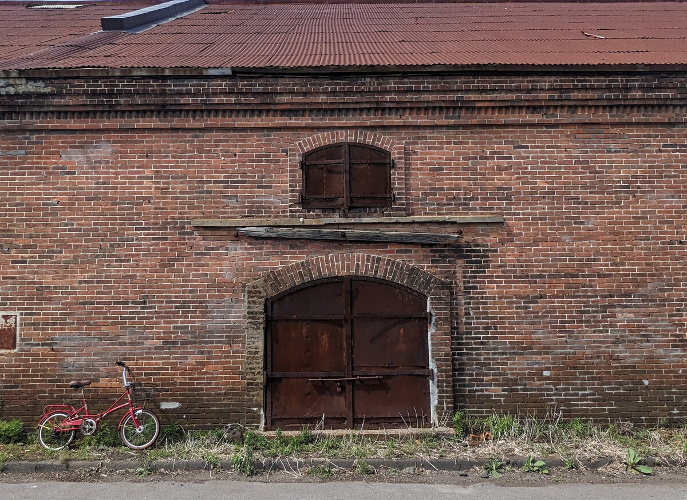
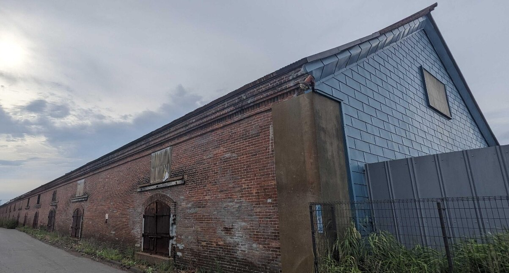
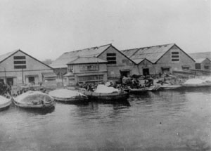
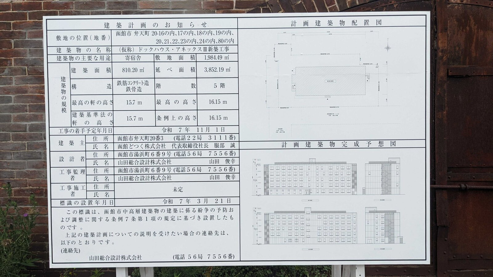
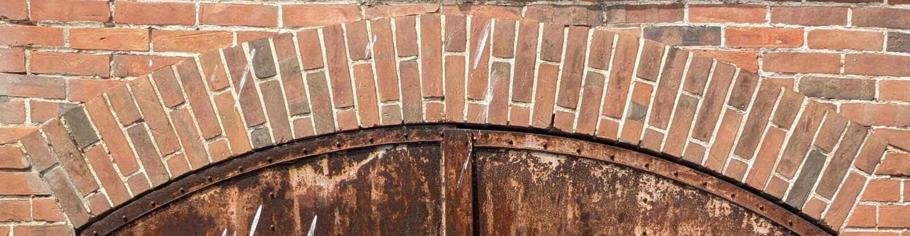
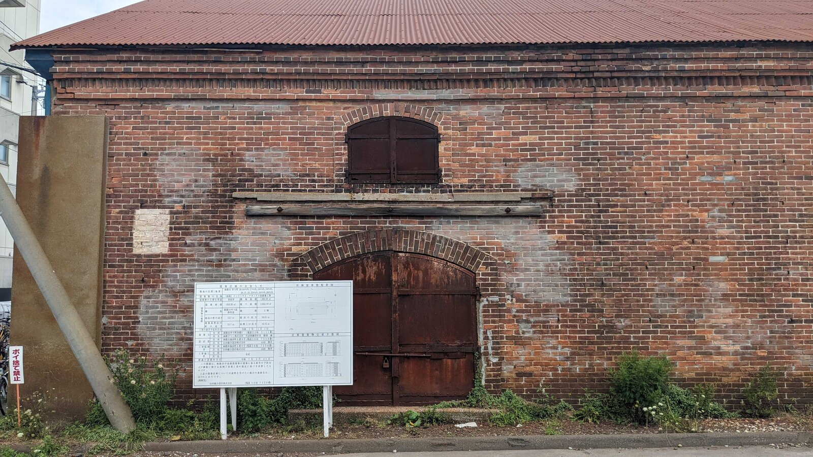

<section id="home" class="hero">
    

        

            <h1><a href="#home" class="title-link">函館の隠れた煉瓦</a></h1>
            
弁天倉庫—125年の記憶が消えゆく前に

        

    

    <a href="#intro" class="scroll-indicator">
        

            
        

    </a>
</section>

<section id="intro" class="content-section">

## 静かな発見

函館山の麓、弁天町。観光客の賑わいから離れたこの場所に、ひっそりと佇む赤レンガの倉庫群があります。

多くの人が知る金森赤レンガ倉庫から、徒歩わずか20分。しかし、ここを訪れる人はほとんどいません。実は、これらの倉庫は金森倉庫より8年も前に建てられた、**函館最古級の赤レンガ建築**なのです。草に覆われた敷地、錆びたトタン屋根、そして風雨に耐えてきた赤レンガの壁。120年以上もの間、函館の海風に吹かれながら、この倉庫たちは静かに時を刻んできました。

これは「**函館どつくレンガ倉庫**」、かつて「**弁天倉庫**」「**柳田倉庫**」と呼ばれた建物群の物語です。

明治の実業家・[柳田藤吉](https://ja.wikipedia.org/wiki/%E6%9F%B3%E7%94%B0%E8%97%A4%E5%90%89){:target="_blank"}の夢から始まり、函館港の発展を支え、戦争を生き延び、そして今、その存在が脚光を浴びることすらなく、ひっそりと函館の片隅に残されています。

けれど、この煉瓦たちに残された時間は、あとわずかです。

## 自分の目で

    <iframe
        src="https://www.google.com/maps/embed?pb=!1m18!1m12!1m3!1d2975.51581289968!2d140.7048241!3d41.77409600000001!2m3!1f0!2f0!3f0!3m2!1i1024!2i768!4f13.1!3m3!1m2!1s0x5f9ef300446740cb%3A0xf83682584adf9cb0!2z5Ye96aSo44Gp44Gk44GP44Os44Oz44Ks5YCJ5bqr!5e0!3m2!1sja!2sjp!4v1755926257115!5m2!1sja!2sjp"
        width="100%"
        height="450"
        style="border:0;"
        allowfullscreen=""
        loading="lazy"
        referrerpolicy="no-referrer-when-downgrade"
        title="函館どつくレンガ倉庫">
    </iframe>

函館駅から市電で函館どつく前方面へ。終点で降りて、線路沿いを少し戻ります。

最初の角を海に向かって曲がると、左手に小さな赤レンガの建物、クライミングジム「<a href="http://homie.jp/" target="_blank">ホーミー</a>」が見えてきます。その先には、花屋「<a href="https://www.epuis.design/" target="_blank">epuis</a>」の優しい店構え。

そして、その向こうに—

100メートル以上も続く、圧倒的な赤煉瓦の壁が現れます。写真では伝わらない、その存在感。明治から令和へ、時を超えて佇む姿に、きっと息をのむことでしょう。

観光地図には載っていません。案内板もありません。けれど、確かにそこに、函館の隠れた宝があるのです。

この宝には、長い物語があります。

</section>

<section id="history" class="content-section">

## 年表

    

        
明治34年（1901年）

        
盛岡出身の実業家・柳田藤吉により「柳田倉庫」として創建。函館の発展と共に歩み始める。

    

    

        
明治43年（1910年）

        
資本金50万円の「弁天倉庫株式会社」に改組。北海道の物流拠点として重要な役割を担う。

    

    

        
大正7年（1918年）

        
実業家・小熊幸一郎により買収される。

    

    

        
昭和18年頃（1943年頃）

        
戦時中、函館どつく株式会社の拡張のため買収され、同社の倉庫として使用。

    

    

        
令和7年10月（2025年10月）

        
125年目で終焉を迎えるか？

    

</section>

<section id="story" class="content-section">

## 柳田の夢

明治32年（1899年）、函館の新浜町。すでに刻み昆布製造業で財を成していた柳田藤吉が、埋立地1万坪を購入しました。62歳。安政3年に若き日の柳田が初めて函館の地を踏んでから、すでに40年以上の歳月が流れていました。

明治34年（1901年）、この広大な土地に、当時の函館では珍しい堂々たるレンガ造りの倉庫群が姿を現しました。「柳田倉庫」の誕生です。赤レンガの壁は、北海道の新時代を告げるかのように、港に向かってそびえ立ちました。 倉庫は瞬く間に評判となりました。その堅牢さ、その美しさ、そして何より圧倒的な収容力。北洋漁業の基地として栄えていた函館で、柳田倉庫は商人たちの信頼を集めていきます。

明治40年（1907年）の大火が函館の街を焼き尽くした時、奇跡が起きました。多くの建物が灰となる中、レンガの壁は炎に耐え、倉庫は生き残ったのです。

## 弁天倉庫から函館どつくへ

明治43年（1910年）、事業は株式会社化され、資本金50万円の「弁天倉庫株式会社」が設立されました。

大正7年（1918年）、実業家・[小熊幸一郎](http://zaidan-hakodate.com/jimbutsu/01_a/01-ogumakou.html){:target="_blank"}の手に渡った弁天倉庫は、さらなる発展を遂げます。最盛期には、巨大な倉庫群が立ち並び、函館港から水揚げされる数々の海産物や物資を収めていました。

しかし、戦争の影が忍び寄ります。

昭和18年（1943年）頃、海軍の要請により函館船渠（現・函館どつく、名村造船の連結子会社）が施設拡張を進める中、弁天倉庫はその敷地に組み込まれることになりました。国策という大きな流れの中で、商人たちの夢の倉庫は、軍需工場の一部となっていったのです。 それでも赤レンガの壁は残りました。空襲にも耐え、戦後の混乱期も乗り越え、静かに函館の海を見つめ続けています。

## 静寂の終わり

函館どつくの一角で、今も現役の倉庫として使われ続けてきた弁天倉庫。

戦後も、高度成長期も、バブルの時代も、そして平成から令和へ—赤レンガの壁は、造船業を支える施設の一部として、その役目を果たし続けてきました。観光地図には載らない、けれど確かにそこで働き続けてきた煉瓦たち。

しかし125年目を迎える2025年、その歴史に転機が訪れようとしています。

これらの倉庫について別の計画があるようです。掲示された建築計画によると、函館どつくが倉庫群を解体し、地上5階建て、延べ面積3,852.19㎡の寄宿舎を建設する予定です。着工は2025年11月1日に予定されており、解体は2025年10月に開始されることが明らかになりました。

長い間、函館どつくからも、名村造船からも、説明は一切ありませんでした。市民への相談もなく、2025年3月21日にひっそりと建築計画の掲示板が立てられただけでした。そして8月25日になって初めて、函館どつくが10月に倉庫の半分を解体する計画を公表して、新聞記事になりました。しかし、これらの歴史的建造物の価値についての議論や、代替案の検討は行われていません。

明治の商人たちの夢、戦火を生き延びた赤レンガ、函館の産業を支え続けた記憶—それらすべてが、静かに幕を下ろそうとしています。

この物語に、[続き](#action)はあるのでしょうか。

</section>

<section class="content-section" id="action">

## この物語の続きを、共に

2025年10月—あとわずかで、125年の歴史が瓦礫になります。

明治34年から函館の海を見つめてきた赤レンガが、金森倉庫より古い函館最古級の産業遺産が、半分解体されようとしています。

でも弁天倉庫の運命は、まだ完全に決まったわけではありません。報道により市民の関心も高まりつつあります。今なら、まだこの倉庫群全体を見ることができます。触れることができます。写真に収めることができます。

ぜひ弁天町を訪れてみてください。自分の目で確かめてください。そして、この光景を記憶に、写真に、心に刻んでください。

友人に、家族に、SNSで、この倉庫群の存在を伝えてみませんか。<a href="https://maps.app.goo.gl/hAT1LPdgkwYTX2VH9" target="_blank">Googleマップ</a>でレビューを書いて、この場所の歴史的価値を共有することもできます。メディアが動き始めた今こそ、市民の声を大きくする時です。一人でも多くの人がこの問題に関心を持てば、保存への道が開けるかもしれません。

知ることから、行動へ。今が重要な時期です。

    <a href="https://x.com/hakodaterenga" class="btn btn-twitter" target="_blank">𝕏 @hakodaterenga</a>
    <a href="https://ja.wikipedia.org/wiki/函館どつくレンガ倉庫" class="btn btn-wikipedia" target="_blank">📖 Wikipedia</a>
    <a href="https://maps.app.goo.gl/hAT1LPdgkwYTX2VH9" class="btn btn-maps" target="_blank">📍 Google マップ</a>

</section>
